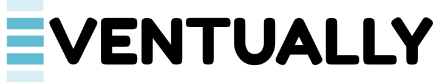

<!-- markdownlint-disable-file MD033 -->
<!-- markdownlint-disable-file MD041 -->

<br />
<div align="center">
    
</div>
<br />
<div align="center">
    <strong>
        Domain-driven Design, Event Sourcing and CQRS for Go
    </strong>
</div>
<br />
<div align="center">
    <!-- Code Coverage -->
    <a href="https://app.codecov.io/gh/get-eventually/go-eventually">
        
    </a>
    <!-- pkg.go.dev -->
    <a href="https://pkg.go.dev/github.com/get-eventually/go-eventually">
        
    </a>
    <!-- License -->
    <a href="./LICENSE">
        
    </a>
</div>
<br />

`eventually` is a library providing abstractions and components to help you:

* Build Domain-driven Design-oriented code, (Domain Events, Aggregate Root, etc.)

* Reduce complexity of your code by providing ready-to-use components, such as PostgreSQL repository implementation, OpenTelemetry instrumentation, etc.

* Implement event-driven architectural patterns in your application, such as Event Sourcing or CQRS.

> [!WARNING]
> Though used in production environment, the library is still under active development.

<!-- markdownlint false positive -->

> [!NOTE]
> Prior to `v1` release the following Semantic Versioning
is being adopted:
>
> * Breaking changes are tagged with a new **minor** release,
> * New features, patches and documentation are tagged with a new **patch** release.

### Install

You can add this library to your project by running:

```sh
go get -u github.com/get-eventually/go-eventually
```

## How to Use

### Aggregate Root pattern

An Aggregate Root is a domain type whose lifecycle is expressed as a
sequence of Domain Events. Its state never changes through direct field
mutation: every change is described by an event, and the aggregate
folds those events back into its in-memory state. This keeps
invariants, audit history, and persistence aligned on a single
mechanism.

Fancy people call it a _transactional boundary_ :)

Start by defining the type. Embed `aggregate.BaseRoot`, implement
`AggregateID()` to return your identifier, and declare an
`aggregate.Type` that names the aggregate and provides a zero-value
factory:

```go
// NOTE: this type is used by things like a Repository implementation
// to correctly save and create new instances of an [aggregate.Root].
var UserType = aggregate.Type[UserID, *User]{
    Name:    "User",
    Factory: func() *User { return new(User) },
}

// The aggregate root itself.
// NOTE: you MUST embed [aggregate.BaseRoot] for it to work!
type User struct {
    aggregate.BaseRoot

    ID    UserID
    Email string
}

// NOTE: you can use any time that implements fmt.Stringer.
// Having an explicitly-defined ID type shows better intent.
func (u *User) AggregateID() UserID { return u.ID }
```

Next, to describe all state transitions the Aggregate Root supports,
implement the `Apply` method and handle all the Domain Events that your
Aggregate Root will emit.

`Apply` should be free of side effects: no I/O, no clock, no validation, just assignments.

```go
func (u *User) Apply(evt event.Event) error {
    switch evt := evt.(type) {
    case WasRegistered: // NOTE: this domain event is defined below.
        u.ID = evt.ID
        u.Email = evt.Email
    default:
        return fmt.Errorf("User.Apply: unexpected event %T", evt)
    }

    return nil
}
```

Mutations are always three things working together: a Domain Event
(named in the past tense) that captures what happened, a matching
branch in `Apply` that performs the state transition, and an exported
method on the aggregate that validates the input and records the event.

`aggregate.RecordThat` appends the event to the aggregate's uncommitted
event list and calls `Apply` to advance the in-memory state.

```go
type WasRegistered struct {
    ID    UserID
    Email string
}

func (WasRegistered) Name() string { return "UserWasRegistered" }

func Register(id UserID, email string) (*User, error) {
    var u User
    if err := aggregate.RecordThat[UserID](&u, event.ToEnvelope(WasRegistered{
        ID:    id,
        Email: email,
    })); err != nil {
        return nil, err
    }
    return &u, nil
}
```

Every subsequent mutation (`ChangeEmail`, `Deactivate`, and so on)
follows the same shape: define the event, add the case to `Apply`,
expose a method that validates and records.

### Persistance with Aggregate Repository interface

Aggregate Roots are loaded and persisted through the
`aggregate.Repository` interface.

In `eventually` there are a couple of implementation types:

- **`aggregate.EventSourcedRepository`** stores only the Domain Events
  recorded by the aggregate and rehydrates state by replaying them. See
  [Event Sourcing](#event-sourcing) below for the details.

- **`postgres.AggregateRepository`** stores the aggregate's current
  state as a serialized snapshot in an `aggregates` table
  and reads it back directly on `Get`. The recorded Domain Events are persisted in
  the same transaction into the `events` and `event_streams` tables,
  acting as an append-only audit log alongside the snapshot:

  ```go
  userRepository := postgres.NewAggregateRepository(
      pool,
      UserType,
      userSerde,    // serde.Bytes[*User]
      messageSerde, // serde.Bytes[message.Message]
  )
  ```

  Pick this when you want snapshot-style reads but still need the event
  log for projections, auditing, or downstream consumers.

### CQRS with Commands and Queries

CQRS - or _Command/Query Responsibility Segregation_ - splits the write path from the read path.

**Commands** express an intent to change state, named in the imperative present tense
(`RegisterUser`, `PlaceOrder`), and return no domain data, only success
or failure.

**Queries** ask for information to display or act upon, and
return a result without mutating anything. Keeping the two separate
lets each side evolve its model, its storage, and its scaling profile
independently.

In `eventually`, both commands and queries are plain Go types
(respectively `command.Command` and `query.Query`) with a `Name() string` method
to give them meaningful, human-readable names.

Their handlers implement `command.Handler[T]` or `query.Handler[T, R]` and stay thin:
get aggregate root with repository, delegate command to aggregate root method, persist new version.

A command handler drives the aggregate through its exported methods and
writes the result back through a repository:

```go
type RegisterUserCommand struct {
    ID    UserID
    Email string
}

func (RegisterUserCommand) Name() string { return "RegisterUser" }

type RegisterUserCommandHandler struct {
    Repository aggregate.Saver[UserID, *User]
}

func (h RegisterUserCommandHandler) Handle(
    ctx context.Context,
    cmd command.Envelope[RegisterUserCommand],
) error {
    u, err := Register(cmd.Message.ID, cmd.Message.Email)
    if err != nil {
        return err
    }
    return h.Repository.Save(ctx, u)
}
```

A query handler executes the query on the data source of choice, and returns it
in the expected format.

```go
type GetUserQuery struct {
    ID UserID
}

func (GetUserQuery) Name() string { return "GetUser" }

type GetUserQueryHandler struct {
    Getter aggregate.Getter[UserID, *User]
}

func (h GetUserQueryHandler) Handle(
    ctx context.Context,
    q query.Envelope[GetUserQuery],
) (*User, error) {
    return h.Getter.Get(ctx, q.Message.ID)
}
```

For read-specialized queries, you may interact directly with the underlying
data source connection pool, or through a higher-level abstraction like `sqlx`.

Consider a query that lists every user registered with a `@gmail.com`
address. The aggregate repository isn't a fit here: we don't want to
rehydrate every `User` just to read two fields. Instead, the handler
talks directly to Postgres through `pgx` and returns a projection
shaped for the caller:

```go
type ListGmailUsersQuery struct{}

func (ListGmailUsersQuery) Name() string { return "ListGmailUsers" }

type UserSummary struct {
    ID    UserID
    Email string
}

type ListGmailUsersQueryHandler struct {
    Pool *pgxpool.Pool
}

func (h ListGmailUsersQueryHandler) Handle(
    ctx context.Context,
    _ query.Envelope[ListGmailUsersQuery],
) ([]UserSummary, error) {
    rows, err := h.Pool.Query(ctx,
        `SELECT id, email FROM users WHERE email LIKE '%@gmail.com'`)
    if err != nil {
        return nil, fmt.Errorf("ListGmailUsersQueryHandler: query failed, %w", err)
    }
    defer rows.Close()

    var users []UserSummary
    for rows.Next() {
        var u UserSummary
        if err := rows.Scan(&u.ID, &u.Email); err != nil {
            return nil, fmt.Errorf("ListGmailUsersQueryHandler: scan failed, %w", err)
        }
        users = append(users, u)
    }
    return users, rows.Err()
}
```

### Event Sourcing

Event Sourcing is a different way of persisting entities' and aggregate roots' state.
Instead of persisting the latest snapshot of your entity, the event store keeps
the full, ordered log of Domain Events that led to it. Rebuilding the
state becomes a matter of replaying that log through `Apply`.

In `eventually`, this is implemented through an `event.Store` (for Domain Events storage and retrieval)
paired with an `aggregate.EventSourcedRepository` that uses the `event.Store` as backend.

`Save` appends the events recorded by the aggregate
since it was loaded; `Get` rehydrates the aggregate by replaying the
stream through `Apply`:

```go
eventStore := event.NewInMemoryStore()
userRepository := aggregate.NewEventSourcedRepository(eventStore, UserType)

// Persist recorded events.
if err := userRepository.Save(ctx, user); err != nil {
    // ...
}

// Rehydrate from the event stream.
u, err := userRepository.Get(ctx, userID)
```

Swap `event.NewInMemoryStore()` for `postgres.NewEventStore(...)` when
you need durable storage.

## Examples

End-to-end examples live under [`examples/`](./examples):

* [`examples/todolist`](./examples/todolist) — a Connect-based TodoList
  service demonstrating aggregates, commands, queries, and BDD-style
  scenario tests, backed by the in-memory event store.

## Contributing

Thank you for your consideration ❤️ You can head over our [CONTRIBUTING](./CONTRIBUTING.md) page to get started.

## License

This project is licensed under the [MIT license](LICENSE).

### Contribution

Unless you explicitly state otherwise, any contribution intentionally submitted for inclusion in `go-eventually` by you, shall be licensed as MIT, without any additional terms or conditions.
